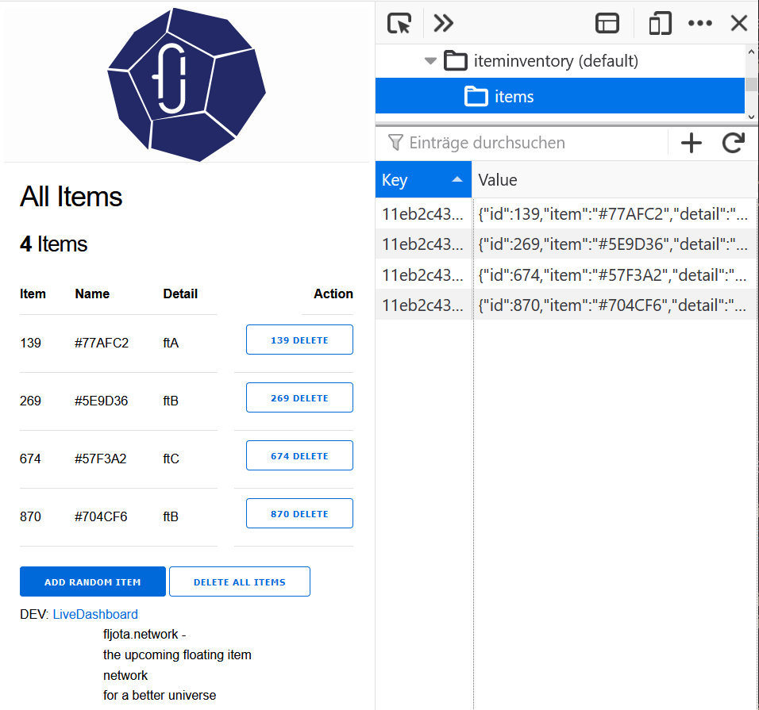

# fljota.network WebpackPwa _phase 0_ 

The core of the **fljota.network** is the access to your personal item inventory. This Progressive Web App (PWA) **stores all your data localy** on your smartphone's or desktop's browser. The items are stored in the indexedDB Browser Database, which is only accessible on this one device. Furthermore this webapp is fully functional in offline mode. The webapp doesn't need any serverside datastorage. 

'As a user you keep all your data local.'

For Demo cases you can publish your presence, the amount of your items and some sensor data in real time to others. All published data is anonymous and for demo purposes.

Sometimes you can catch a first impression on 'http://nightly.fljota.network' or https://nightly.fljota.network (accept the SSL Policies) if my demo system is up and running.

## Prototyping Release Notes

0.1.5
- Fixed URLs for Demo System
- Experimental Google Cloud micro VM Deploy Tutorial
- Dummy Sensor Data in localstorage

0.1.4
- Latest MIX Dependencies in mix.exs file
- Fixed Troubleshooting for rpi4 Install
- Project Intro and a first how-it-works picture

The second 0.1.3 contains:

- RPi4 install instruction
- Updated webpack-pwa-manifest 4.3.0
- Fixed jpeg-js 0.4.2 for security reasons

The very first 0.1.2 contains:

- prototyped item inventory based on localbase / indexedDB
- PWA manifest with service-worker
- Phoenix Channel for item counting
- Sensor API Dummy

## How to start your fljota.pwa dev server (the short version)?

  * Install dependencies with `mix deps.get`
  * Install Node.js dependencies with `npm install` inside the `assets` directory
  * Start Phoenix endpoint with `mix phx.server`

DEV is configured for both http: and https: for sensor permissions

Now you can visit [`localhost:4000`](http://localhost:4000) from your browser or check 'http://nightly.fljota.network' or 'https://nightly.fljota.network' if my nightly system is up.

## How to start the fljota.pwa package release version (the smart way)?

Download the self-contained directory that includes the Erlang VM, Elixir, all fljota.pwa code and dependencies. Drop everything on your production machine. 

`_build/prod/rel/*pwa*/bin/*pwa* start`

## How to install fljota.pwa on your rpi4 ubuntu 20.04 for local experiments (the nerdy way)?

1. Check your Ubuntu Version
`lsb_release -d`

2. Check your Elixir Version
`elixir -v`

3. Install latest Elixir
`sudo apt install elixir`

4. Check your Elixir version again:
 `elixir -v`

5. Clone this Repo to your filesystem
`git clone https://github.com/fljota/pwa.git`

6. Change Directory to your local copy
`cd pwa/`

7. You need to install all needed npm packages in the asset Directory
`cd assets/`

8. Install all Packages (as described in the short version)
`npm install`

9. If you haven't installed npm
`sudo apt install npm`

10. Now you can install all needed packages (this may take a while on a rpi4)
`npm install`

11. Jump back
`cd ..`

12. Try to Launch the Pheonix Dev Server
`mix phx.server`

13. Oh. You need all the MIX Dependencise
`mix deps.get`

14. If everything went correct you can now start your localhost:4000 (it will take some time on your rpi4, webpack needs quiet long for the first build)
`mix phx.server`

15. If any further errors occour, take time to fix them
:-) Sorry - Work in progress

15.1 If you fall in gettext parse issues you need to install some extra tooling (this may take even a longer time on a rpi4)
`sudo apt install erlang`

15.2 If you 'Could not find "rebar3"... just install it with Y or
`mix local.rebar --force`

## How to install fljota.pwa in Google Cloud on a free micro VM (the stylish way?)

If you have your Google Cloud Platform ready you can spin up the fljota.pwa without local soft- or hardware.

1. Go to your https://console.cloud.google.com

Configure and start a Micro VM:
e.g. e2-micro (2 vCPUs, 1 GB Speicherplatz)
use your favorite os e.g. Ubuntu 18.04

2. Start your VW via the Cloud Console

3. SSH via browser terminal directly in your micro vm.

4. Check the Elixir version and install, if not available
`elixiv -v`

5. Clone this Repo to your filesystem
`git clone https://github.com/fljota/pwa.git`

6. cd in the new local directory
`cd pwa/`

7. First you need to gett all mix dependencise
`mix deps.get`

8. You need to install all needed npm packages in the asset Directory
`cd assets/`

9. Install all Packages (as described in the short version)
`npm install`

10. If you haven't installed npm
`sudo apt install npm`

11. Now you can install all needed packages (this may take a while on a small vm)
`npm install`

12. cd back to your pwa main directory
`cd ..`

13. Generate all digest Files, if you miss priv/static  generate it
`mkdir priv/static/ && mix phx.digest`

14. Finally start your PWA via (this may take 10-15 minutes an the micro vm, so take your time)
`mix phx.server`

15. Ran into any issues?
hands on the console.logs...

15.1 webpack is missing?

The fljota.network PWA is based on Elixir Phoenix
